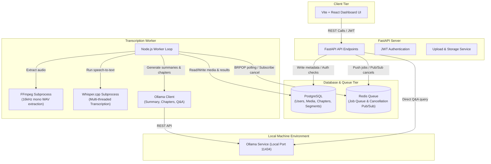

# 🎧 SummaCast

SummaCast is a premium, privacy-focused, local-first podcast and video summarization dashboard. It lets users upload audio or video files, automatically transcribe them using a local instance of **Whisper.cpp**, and generate rich timestamped chapters, summaries, and key insights using local LLMs via **Ollama**. It also features an interactive dashboard player that synchronizes transcripts with media playback and allows you to chat directly with your media content through a local LLM Q&A chat.

---

## 🚀 Key Features

*   **🔒 Privacy-First & Offline-Capable**: Runs entirely on your local machine using local transcription (Whisper.cpp) and local LLMs (Ollama). No cloud API bills or data privacy concerns.
*   **🎙️ Local Whisper Transcription**: Automatic multi-threaded Whisper transcription (`ggml-tiny.bin` model) to extract high-accuracy transcripts with precise segment timestamps.
*   **🧠 Local AI Summaries & Chapters**: Uses Ollama with model options like `qwen3:8b` to group sections into logical, readable, timestamped chapters and write comprehensive multi-paragraph summaries.
*   **💬 LLM Q&A Context Chat**: Ask questions directly about the podcast/video. SummaCast feeds the relevant transcript context to your local LLM to give you instant, accurate answers.
*   **⏯️ Premium Media Player & Dashboard**: Visualized dashboard with audio/video support, interactive chapter bookmarks, click-to-seek transcript synchronization, and transcript downloading.
*   **👥 Session-Based Auth**: Secure JWT register/login endpoints to isolate media libraries and workspace dashboard per user.
*   **🛑 Instant Process Cancellation**: Safe, real-time cancellation of active transcription or summarization tasks using Redis Pub/Sub channels to terminate subprocesses immediately on demand.

---

## 🏗️ Architecture & Component Design

SummaCast is built using a decoupled service architecture that balances responsive web interactions with heavy background processing.



---

## 🛠️ Tech Stack

*   **Frontend**: React (Vite), Vanilla CSS, Tailwind, Lucide Icons, HTML5 Audio/Video.
*   **Backend**: Python, FastAPI, SQLAlchemy, pg8000, python-jose, bcrypt.
*   **Background Worker**: Node.js, `fluent-ffmpeg`, `ioredis`, `pg` (node-postgres), custom subprocess wrappers.
*   **Database & Cache**: PostgreSQL (v15), Redis (v7), Docker.
*   **Local AI Engine**: `whisper.cpp` (v1.6.0 binary wrapper + `ggml-tiny.bin` model) and local **Ollama** server.

---

## ⚙️ Prerequisites

Before setting up SummaCast, ensure you have the following installed on your machine:

1.  **Docker & Docker Compose** (for database and queue setup)
2.  **Node.js (v18+)** (for the worker and frontend development)
3.  **Python (3.9 - 3.12+)** (for the FastAPI backend server)
4.  **FFmpeg** (installed and added to your system environment PATH, or configured in the worker configuration env)
5.  **Ollama** (running locally on port `11434`)

---

## 🔧 Setup & Installation

### 1. Database & Cache Services (Docker)
Initialize PostgreSQL and Redis using the root docker-compose configuration:
```bash
docker-compose up -d
```
This starts:
*   PostgreSQL at `localhost:5432` (Database: `summacast`, User: `summacast_user`, Password: `summacast_password`)
*   Redis at `localhost:6379`

---

### 2. Ollama Local LLM Configuration
1. Install [Ollama](https://ollama.com) on your system.
2. Start the Ollama application.
3. Download the model (default is `qwen3:8b`, or any custom model you choose to configure):
```bash
ollama pull qwen3:8b
```

---

### 3. Backend API Service Setup
1. Navigate to the backend directory:
   ```bash
   cd backend
   ```
2. Install the Python dependencies:
   ```bash
   pip install -r requirements.txt
   ```
3. Run the FastAPI development server:
   ```bash
   uvicorn main:app --reload --port 8000
   ```
   *The backend will run on `http://localhost:8000`. You can access the auto-generated Swagger API documentation at `http://localhost:8000/docs`.*

---

### 4. Background Transcription Worker Setup
1. Navigate to the worker directory:
   ```bash
   cd worker
   ```
2. Install Node dependencies:
   ```bash
   npm install
   ```
3. Initialize/Download Whisper binaries and models using the setup script:
   ```powershell
   ./setup_whisper.ps1
   ```
   *This PowerShell script will automatically download the precompiled `whisper.cpp` binaries (`main.exe`) and the `ggml-tiny.bin` model into the worker directories.*
4. Configure `.env` file in the `worker/` directory:
   Create a `.env` file inside `worker/` (or adapt the existing one):
   ```env
   REDIS_URL=redis://localhost:6379
   WHISPER_MODEL_PATH=models/ggml-tiny.bin
   FFMPEG_PATH=C:\path\to\your\ffmpeg.exe
   OLLAMA_HOST=http://localhost:11434
   OLLAMA_MODEL=qwen3:8b
   ```
5. Start the background worker:
   ```bash
   npm run dev
   ```

---

### 5. Frontend Dashboard Setup
1. Navigate to the frontend directory:
   ```bash
   cd frontend
   ```
2. Install the React packages:
   ```bash
   npm install
   ```
3. Start the Vite React development server:
   ```bash
   npm run dev
   ```
   *The client dashboard will be available at `http://localhost:5173`.*

---

## 📖 Usage Workflow

1.  **Register / Login**: Open the frontend UI at `http://localhost:5173`. Create a new account or log in with your credentials to start an isolated session.
2.  **Upload Media**: Click the file uploader to drag and drop or browse for an audio (`.mp3`, `.wav`, `.m4a`) or video (`.mp4`, `.webm`) file.
3.  **Background Processing**:
    *   Once uploaded, the media status enters `UPLOADED` and is added to the Redis queue.
    *   The background worker picks up the job and converts the audio format (`PROCESSING`).
    *   The worker feeds the audio to Whisper to extract transcript segments.
    *   The status transitions to `SUMMARIZING` as it prompts Ollama to write summaries and structure timestamped chapters.
    *   Finally, the status changes to `COMPLETED` (or `FAILED` if cancelled/erred).
4.  **Interactive Playback**: Click on your processed media file to load it. 
    *   Use the **Chapters sidebar** to navigate bookmarks with direct timestamps.
    *   The **Interactive Transcript** highlights paragraphs in real time as the player advances. You can click on any transcript segment to jump the media player timeline immediately to that timestamp.
    *   Use the **Q&A Chatbot** in the lower panel to type questions about the media (e.g. "What did they conclude about X?") to receive instant answers from the local LLM.
    *   Download raw formatted transcripts using the **Download** action button.
    *   Cancel active uploads/processes on-the-fly using the **Cancel** button.

---

## 🤝 Contributing & Maintenance
All modifications to database models, queue protocols, and worker scripts should update relative schemas:
*   **Database Changes**: Maintained in [models.py](file:///c:/Users/ANIKET%20SAROJ/Desktop/CasT/backend/models.py) and mapped in worker's [db.js](file:///c:/Users/ANIKET%20SAROJ/Desktop/CasT/worker/db.js).
*   **Background Jobs logic**: Programmed in worker's [index.js](file:///c:/Users/ANIKET%20SAROJ/Desktop/CasT/worker/index.js), transcribing in [transcribe.js](file:///c:/Users/ANIKET%20SAROJ/Desktop/CasT/worker/transcribe.js), and summarizing/chaptering prompts in [summarize.js](file:///c:/Users/ANIKET%20SAROJ/Desktop/CasT/worker/summarize.js).
